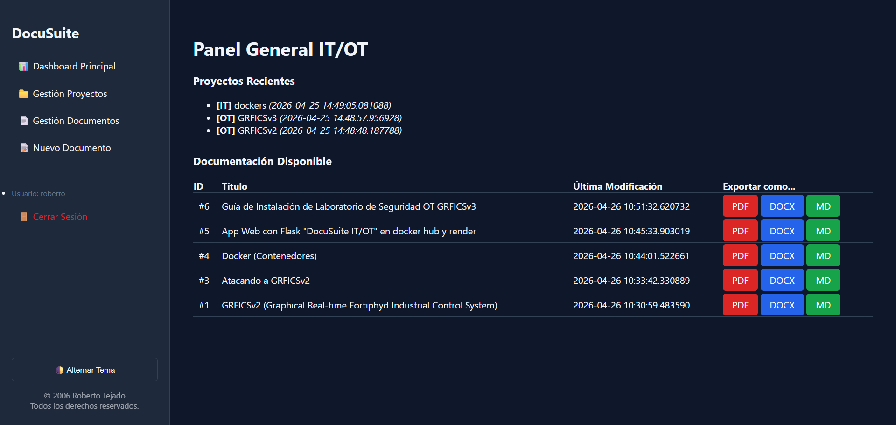
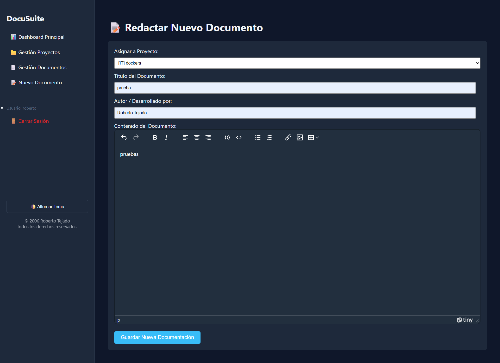
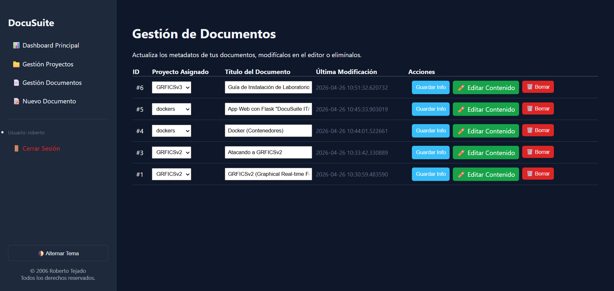

# 📝 DocuSuite IT/OT

[](https://robertroof-docusuite.hf.space/)
[](https://github.com/robertotejado/docusuite-huggingface)
[](https://www.linkedin.com/in/roberto-tejado/)

**DocuSuite IT/OT** es una plataforma web integral diseñada para la creación, gestión y exportación de documentación técnica. Optimizada para profesionales de IT y OT (Tecnología de la Información y Operaciones), permite redactar manuales, guías de despliegue y configuraciones complejas en un entorno seguro y altamente personalizable.

<p align="center">
  
</p>

---

## ✨ Características Principales

* **Editor Enriquecido (WYSIWYG):** Integración completa con TinyMCE, adaptado con modo claro/oscuro automático según las preferencias del sistema.

<p align="center">
  
</p>

* **Gestión de Proyectos y Documentos:** Interfaz intuitiva para actualizar metadatos, reasignar proyectos y eliminar registros en tiempo real.

<p align="center">
  
</p>

* **Soporte Avanzado para Código:** Resaltado de sintaxis profesional impulsado por Prism.js, ideal para documentar comandos de `Bash`, configuraciones `YAML`, `Docker`, `JSON` y más.
* **Gestión de Imágenes en la Nube:** Subida de imágenes "Drag & Drop" (arrastrar y soltar) integradas directamente en el editor, alojadas de forma segura y optimizada en **Cloudinary**.
* **Base de Datos Robusta:** Arquitectura relacional utilizando **PostgreSQL** (vía Supabase) para gestionar usuarios, proyectos y versiones de documentos.
* **Exportación Multiformato:** Capacidad para exportar la documentación final a formatos estándar (PDF, DOCX, Markdown).
---

## 🛠️ Stack Tecnológico

* **Backend:** Python 3.11, Flask, SQLAlchemy / Psycopg2.
* **Frontend:** HTML5, CSS3, JavaScript (Vanilla), TinyMCE, Prism.js.
* **Base de Datos:** PostgreSQL (Supabase Transaction Pooler).
* **Almacenamiento de Medios:** Cloudinary API.
* **Infraestructura / Despliegue:** Docker, Docker Hub, Hugging Face Spaces.

---

## 🚀 Instalación y Despliegue Local

Puedes ejecutar este proyecto fácilmente en tu máquina local gracias a Docker Compose.

### 1. Requisitos previos
* [Docker](https://docs.docker.com/get-docker/) y [Docker Compose](https://docs.docker.com/compose/install/) instalados.
* Git.

### 2. Clonar el repositorio
```bash
git clone https://github.com/robertotejado/docusuite-huggingface.git
cd docusuite-huggingface
```

### 3. Configurar Variables de Entorno
Renombra el archivo de ejemplo para crear tu entorno local:
```bash
cp .env.example .env
```
Abre el archivo `.env` y rellena tus credenciales reales (Postgres, Cloudinary, etc.). *Nota: El archivo `.env` está ignorado en Git por seguridad y nunca se subirá al repositorio.*

### 4. Construir y Levantar los Contenedores
```bash
docker-compose up --build
```
La aplicación estará disponible en `http://localhost:7860`.

---

## ☁️ Despliegue en Producción (Hugging Face Spaces)

Este proyecto está preparado para desplegarse de forma nativa en **Hugging Face Spaces** utilizando su SDK de Docker.

1. Crea un nuevo **Space** en Hugging Face seleccionando el entorno **Docker (Blank)**.
2. Configura el archivo `README.md` del Space para que apunte a la imagen base o utiliza el `Dockerfile` proporcionado.
3. Ve a la pestaña **Settings** > **Variables and secrets**.
4. Añade los siguientes "Secrets" con tus credenciales de producción:
   * `DATABASE_URL`
   * `CLOUDINARY_CLOUD_NAME`
   * `CLOUDINARY_API_KEY`
   * `CLOUDINARY_API_SECRET`
   * `SECRET_KEY`
5. ¡El contenedor se construirá y desplegará automáticamente!

---

## 🔒 Seguridad
Se ha implementado el uso estricto de variables de entorno (`python-dotenv`) para proteger las credenciales y cadenas de conexión a bases de datos. Revisa el archivo `.gitignore` para confirmar que ningún archivo de configuración confidencial se incluya en los commits.

---

## 👨‍💻 Autor
Desarrollado y mantenido por **[Roberto Tejado](https://www.linkedin.com/in/roberto-tejado/)** - *Ingeniería y Documentación IT/OT*.
## 🌐 Web  https://robertroof-docusuite.hf.space
 
